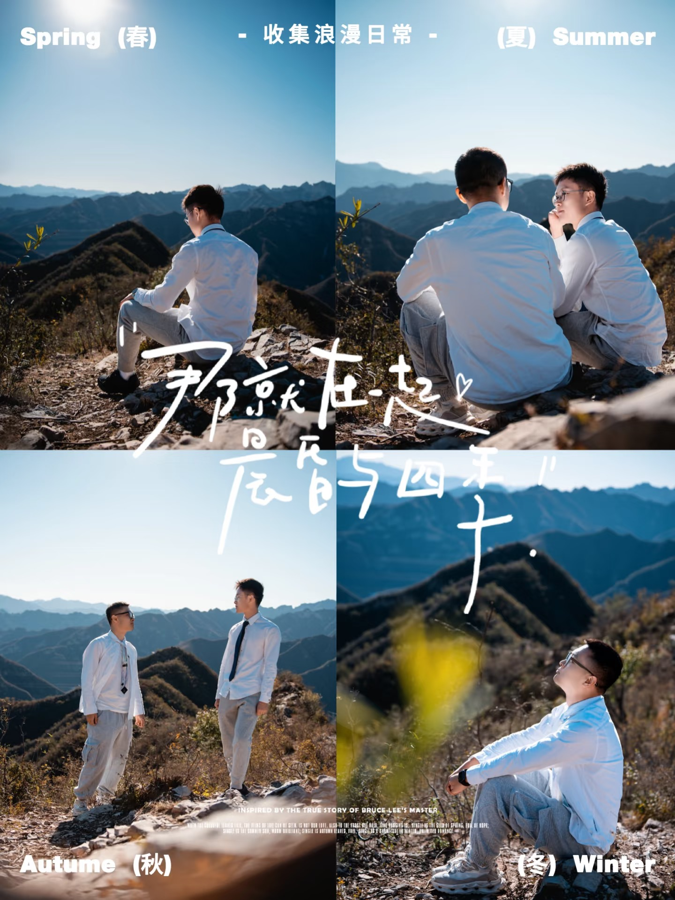
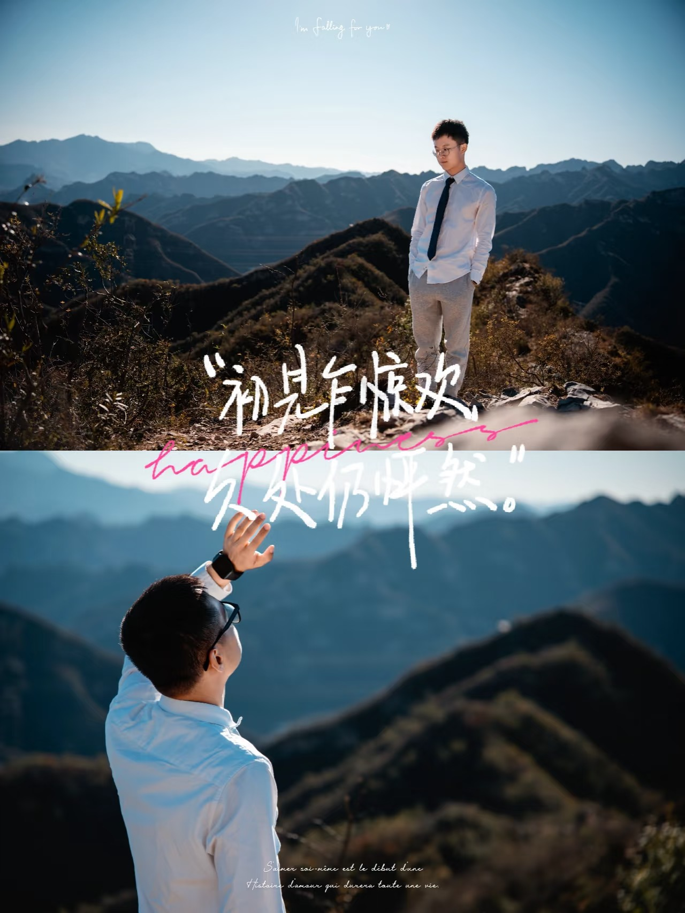

## 因为不想分离

ENFP  
混沌·善  
同谐·欢愉·开拓·记忆  
教育工作者  
洛克王国世界 天空之城的魔法师  
健身菜鸟  
三分钟热度无缝切换  

<!--

**roco2015/roco2015** is a ✨ _special_ ✨ repository because its `README.md` (this file) appears on your GitHub profile.

Here are some ideas to get you started:

- 🔭 I’m currently working on ...
- 🌱 I’m currently learning ...
- 👯 I’m looking to collaborate on ...
- 🤔 I’m looking for help with ...
- 💬 Ask me about ...
- 📫 How to reach me: ...
- 😄 Pronouns: ...
- ⚡ Fun fact: ...
-->
